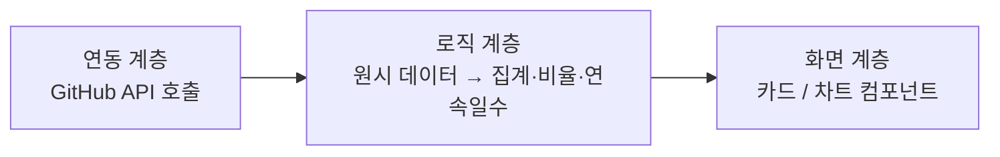
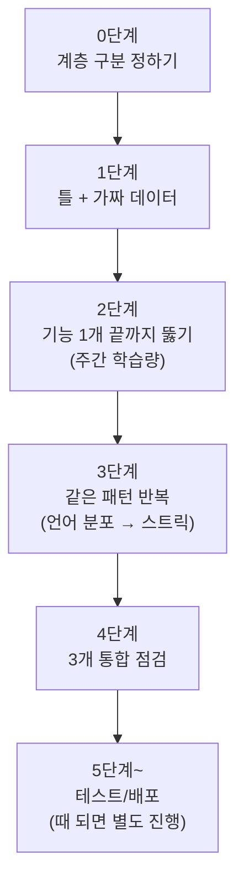

# 개발 로드맵

> 이 로드맵은 Claude(Claude Code)와의 대화를 통해 방향을 설계하고 정리했습니다.

> 초기 세팅 완료 후 본격 개발을 시작하기 위한 작업 순서. OSS 커리큘럼 학습 진도·테스트·배포 타이밍은 별도 관리 — 여기는 **코드를 어떤 순서로 쌓을지**만 기록.

---

## 0. 프로젝트 한 줄 요약

| 항목       | 내용                                                           |
| -------- | ------------------------------------------------------------ |
| 이름       | GitHub 학습 활동 대시보드                                            |
| 형태       | 한 페이지짜리 웹 대시보드 (Next.js, DB 없음)                              |
| 핵심 기능 3개 | ① 주간 학습량 (막대그래프) · ② 언어 분포 (도넛차트) · ③ 학습 스트릭 (컨트리뷰션 그래프 스타일) |
| 데이터 소스   | GitHub API (별도 DB 없이 그대로 사용)                                 |

---

## 1. 계층 구조 — 역할을 3층으로 나눠서 접근

물리적 파일 구조가 아니라, 코드를 짤 때 머릿속에서 나누는 **역할 구분**이다. 이 셋을 처음부터 섞지 않아야 나중에 화면을 바꾸거나 로직을 고칠 때 서로 안 건드린다.

| 계층 | 역할 | 예시 |
|---|---|---|
| **연동 계층** | GitHub API를 실제로 호출 | 커밋/PR/이슈 원시 데이터 가져오기 |
| **로직 계층** | 원시 데이터를 화면이 쓸 숫자로 가공 (순수 함수) | 주간 집계, 언어 비율 계산, 연속 활동일 계산 |
| **화면 계층** | 가공된 숫자를 보여주기만 함 | 막대그래프 카드, 도넛차트 카드, 스트릭 카드 |

---

## 2. 단계별 작업 순서

| 단계 | 목표 | 완료 기준 | 비고 |
|---|---|---|---|
| **0. 계층 구분** | 화면/로직/연동 역할을 어떻게 나눌지 감 잡기 | 셋을 분리해서 개발한다는 원칙에 합의 | 코드 작성 전 사전 정리 |
| **1. 틀 + 가짜 데이터** | 헤더 + 카드 3개(주간/언어/스트릭 자리) 배치 | 손으로 적은 더미 값으로 화면이 안 무너짐 | 실제 API는 아직 연결 안 함 |
| **2. 기능 1개 세로로 관통** | **주간 학습량**만 골라 API 연동 → 가공 → 화면 표시까지 완주 | 실제 GitHub 데이터가 막대그래프로 뜸 | 가장 시간 오래 써도 되는 단계 — 여기서 전체 파이프라인 형태가 잡힘 |
| **3. 나머지 기능 반복** | 언어 분포 → 스트릭 순서로 같은 패턴 재사용 | 연동 계층은 그대로 두고 로직 계층에 함수만 추가 | 새 구조를 매번 만들지 않는다 |
| **4. 통합 점검** | 카드 3개가 한 화면에서 동시에 정상 작동 | 레이아웃 안 깨짐, API 호출 겹쳐서 느려지지 않음 | 개별로 잘 되던 것도 다시 확인 |
| **5. 테스트/배포** | — | — | 때가 되면 별도로 다시 논의 |

---

## 3. 진행 체크리스트

- [ ] 0단계 — 계층 구분 원칙 확정
- [ ] 1단계 — 틀 + 가짜 데이터로 레이아웃 완성
- [ ] 2단계 — 주간 학습량 기능 끝까지 연결
- [ ] 3단계 — 언어 분포 추가
- [ ] 3단계 — 스트릭 추가
- [ ] 4단계 — 3개 기능 통합 점검

---
